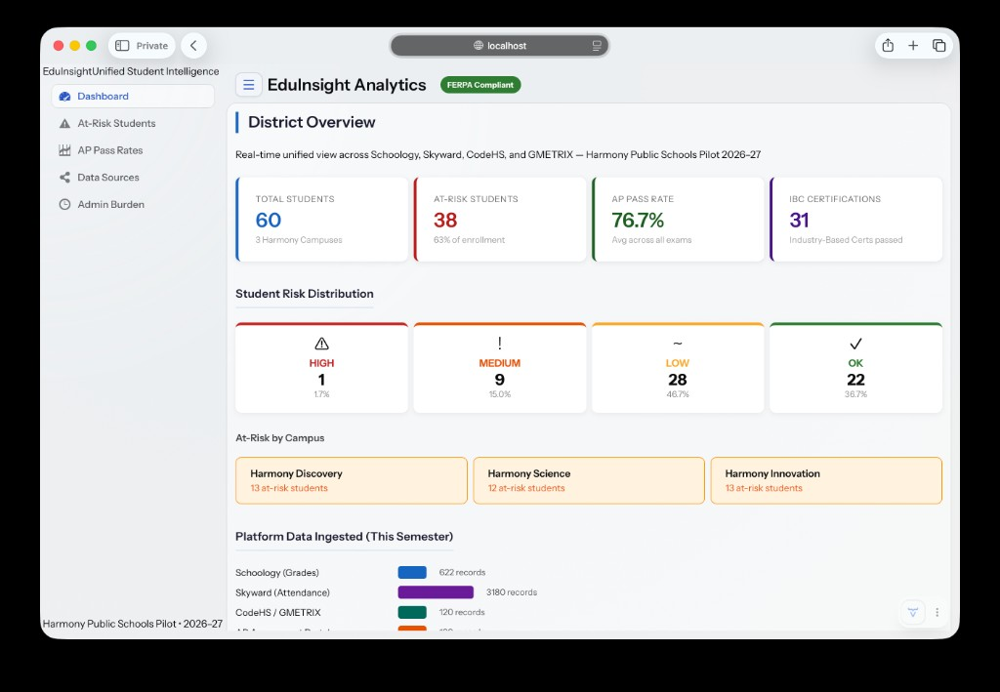
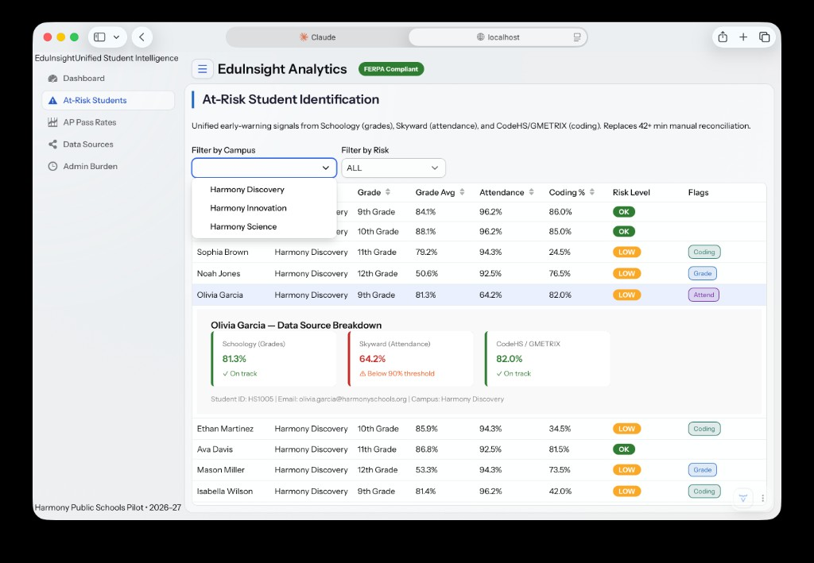
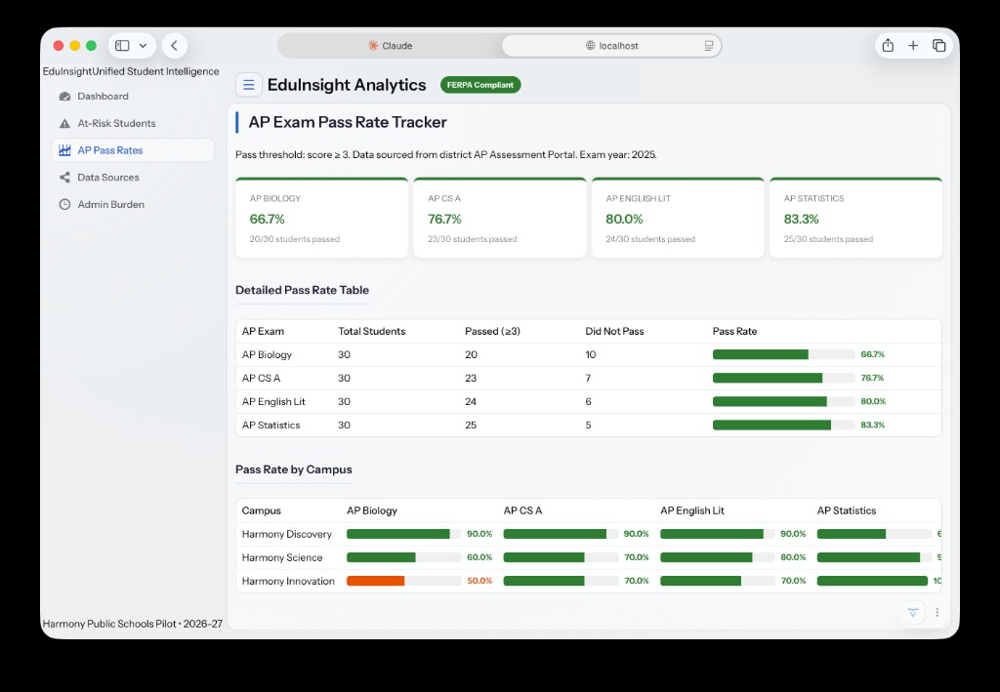
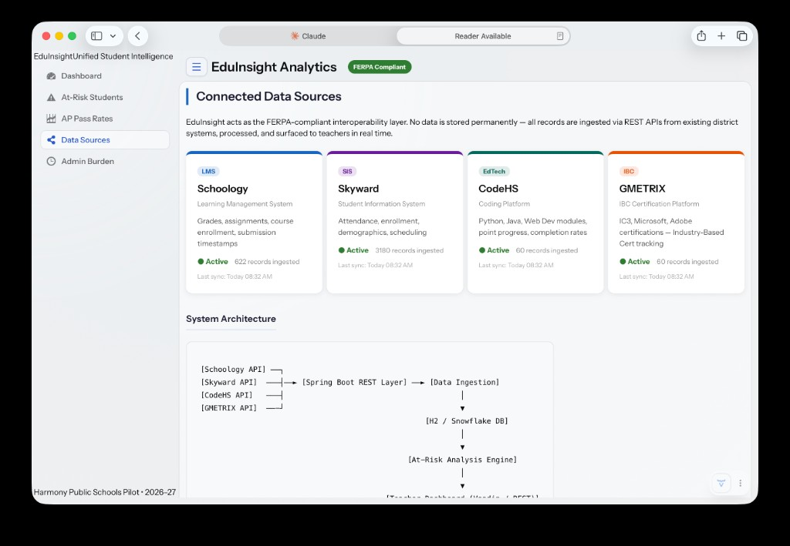
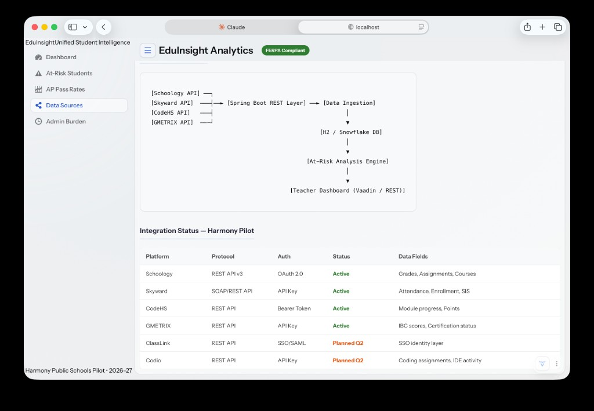
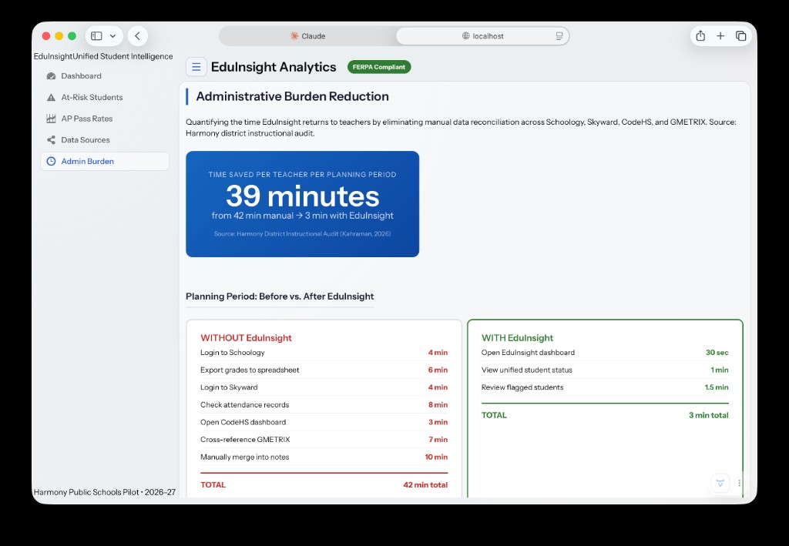
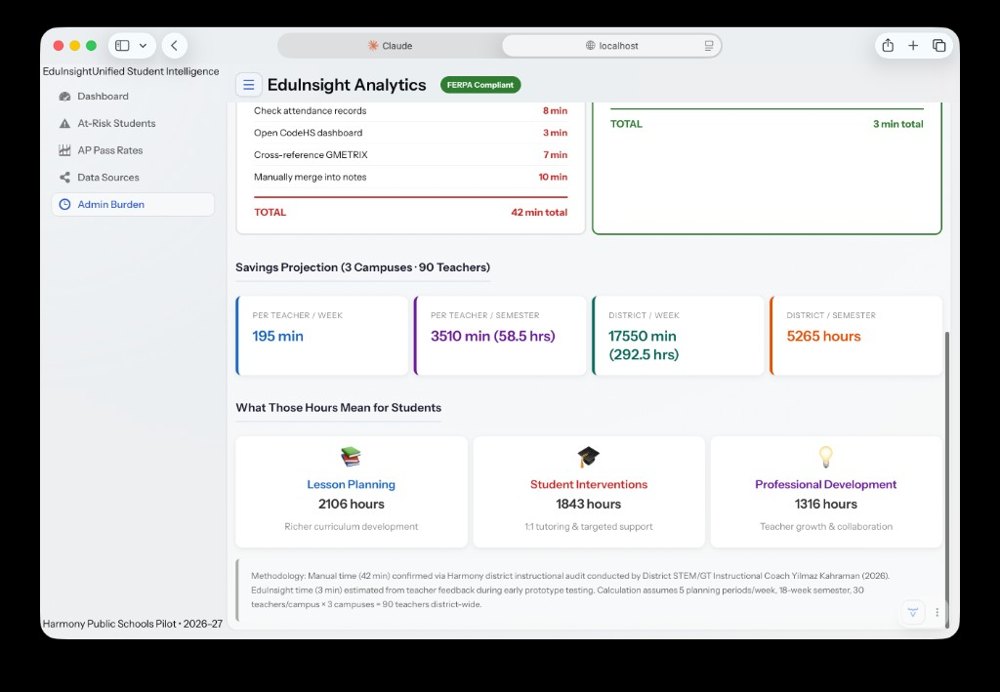

# EduInsight Analytics Project Overview

FERPA-compliant student data middleware that unifies Schoology, Skyward, CodeHS, and GMETRIX into a single teacher dashboard. Built for the Harmony Public Schools 2026-27 pilot.

## Technology Stack

| Layer | Technology |
|-------|-----------|
| Backend | Java 25, Spring Boot 4.0.6 |
| Frontend | Vaadin 25.1.1 |
| Database | H2 in-memory (demo), Snowflake (production target) |
| Build | Gradle 9.4.1 |

## Dashboard Modules

| View | Route | Description |
|------|-------|-------------|
| Dashboard | `/` | Overview: student counts, risk distribution, AP rates, ingestion stats |
| At-Risk Students | `/at-risk` | Filterable grid with early-warning flags from all 3 platforms |
| AP Pass Rates | `/ap-rates` | Exam pass rates per course and campus |
| Data Sources | `/data-sources` | Platform integration cards, architecture diagram, status table |
| Admin Burden | `/admin-burden` | Time-saved metrics: 42 min -> 3 min per planning period |

## Screenshots

### 1) District Dashboard



### 2) At-Risk Student Identification



### 3) AP Exam Pass Rate Tracker



### 4) Connected Data Sources



### 5) Data Integration Status Table



### 6) Administrative Burden Reduction



### 7) Savings Projection and Outcomes



## Demo Data

- 60 students across 3 Harmony campuses (Discovery, Science, Innovation)
- Grade records from Schoology (4 AP courses, 10 records/student)
- Attendance records from Skyward (50+ records/student)
- Coding progress from CodeHS and GMETRIX (IBC certification tracking)
- AP assessment scores for 11th/12th graders

## At-Risk Scoring Model

| Dimension | Platform | Threshold | Weight |
|-----------|----------|-----------|--------|
| Grade Average | Schoology | < 70% | 1 flag |
| Attendance Rate | Skyward | < 90% | 1 flag |
| Coding Completion | CodeHS/GMETRIX | < 60% | 1 flag |

Risk level: HIGH (3 flags), MEDIUM (2), LOW (1), OK (0).

## Running Locally

```bash
./gradlew bootRun
```

App URL: `http://localhost:8080`  
H2 Console: `http://localhost:8080/h2-console` (JDBC: `jdbc:h2:mem:eduinsight`, user `sa`, empty password)

---

MVP demo with synthetic data only. Not for production use.
