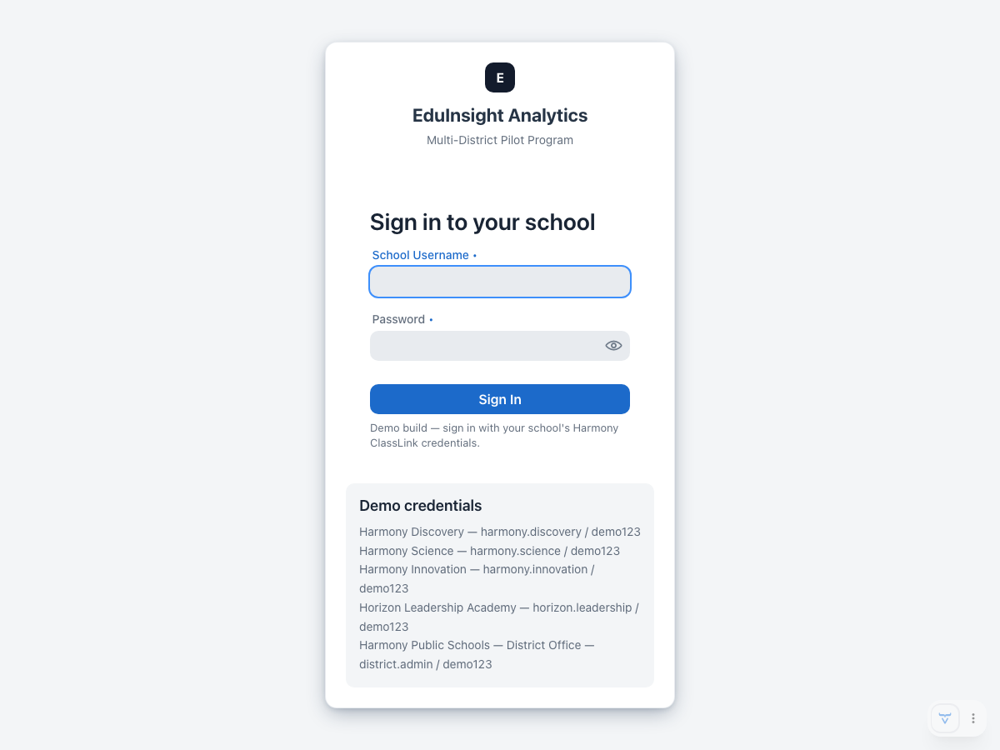
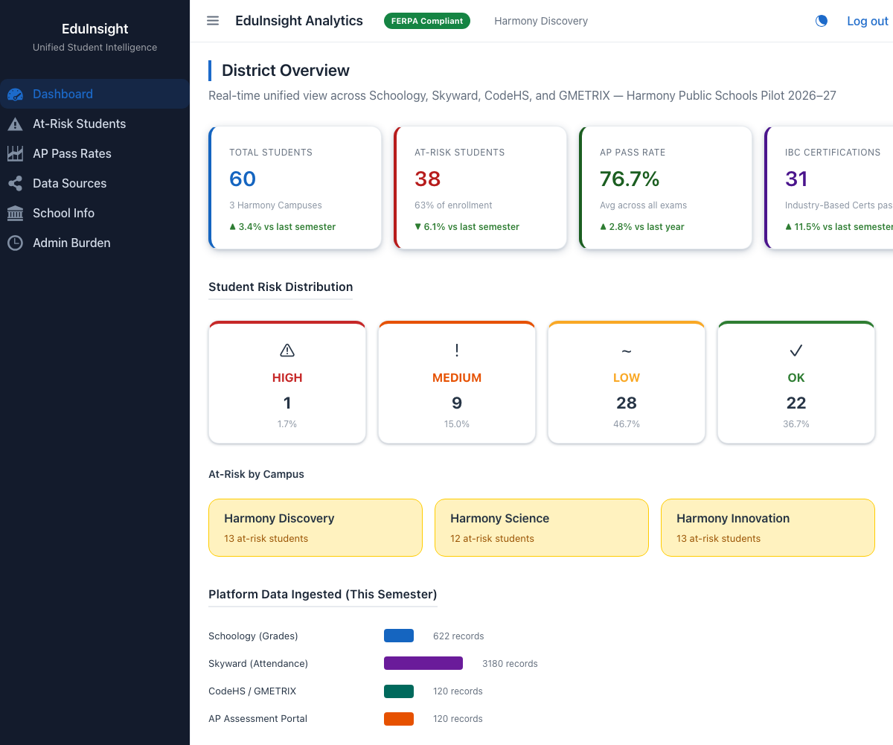
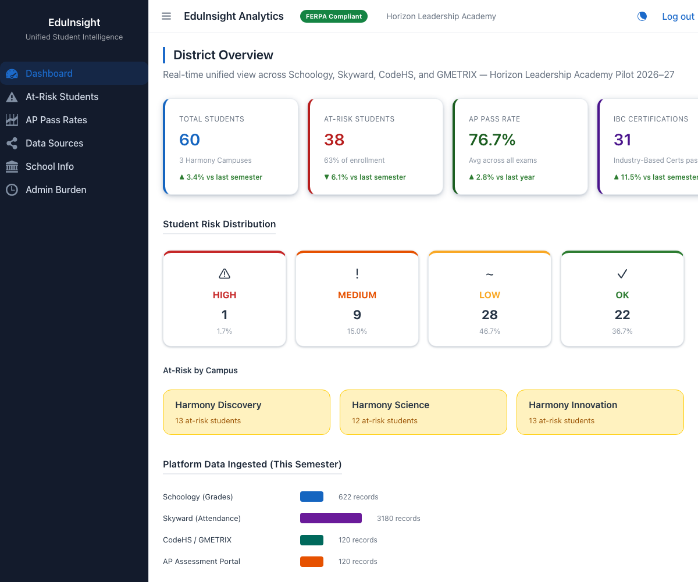
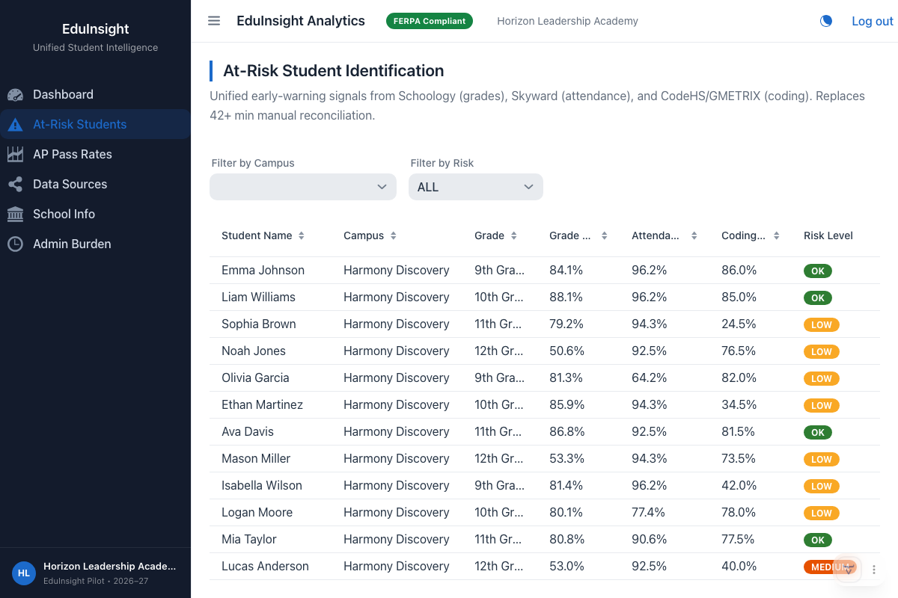
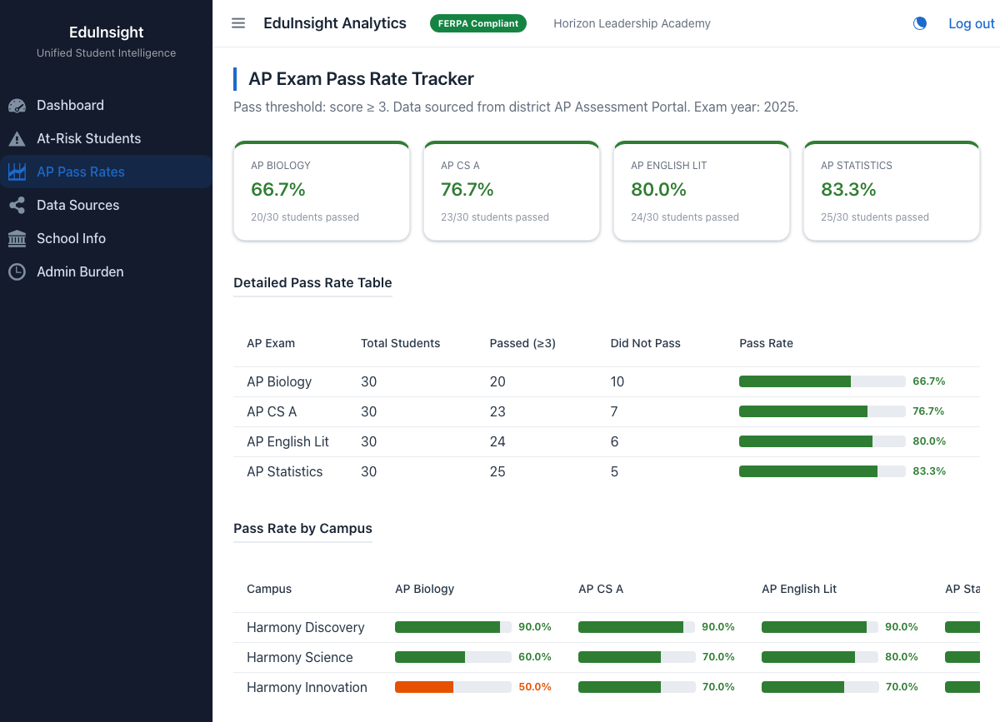
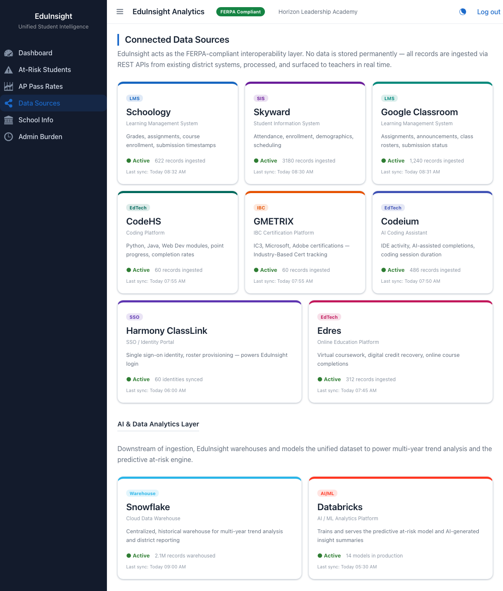
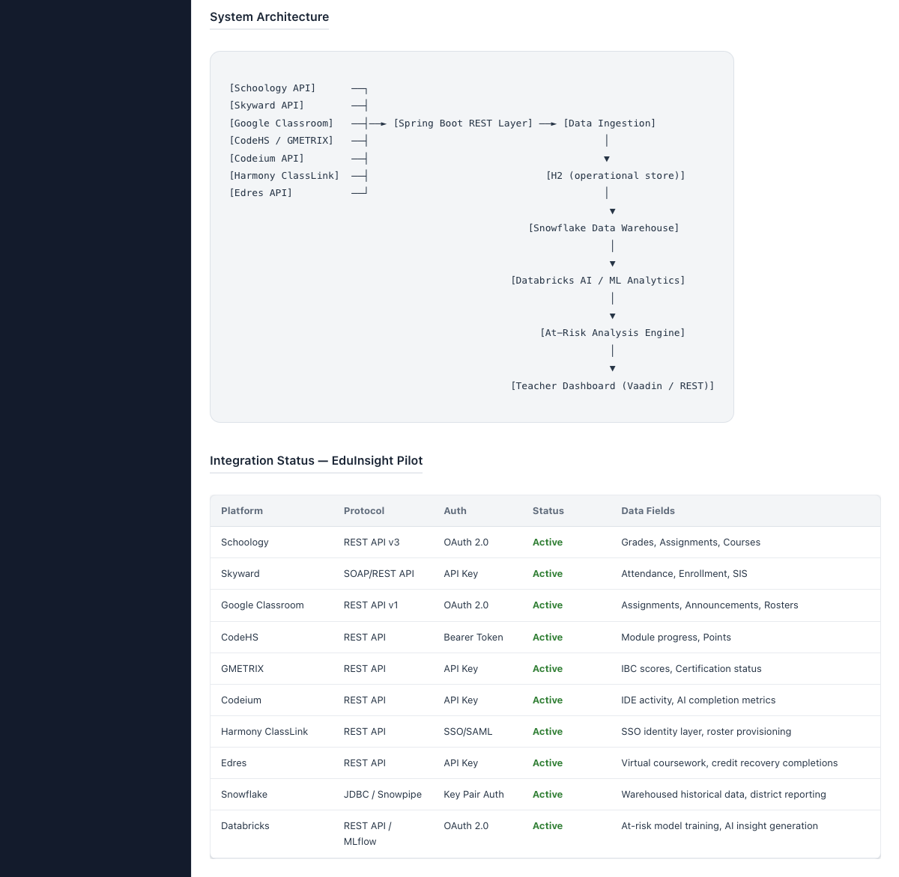
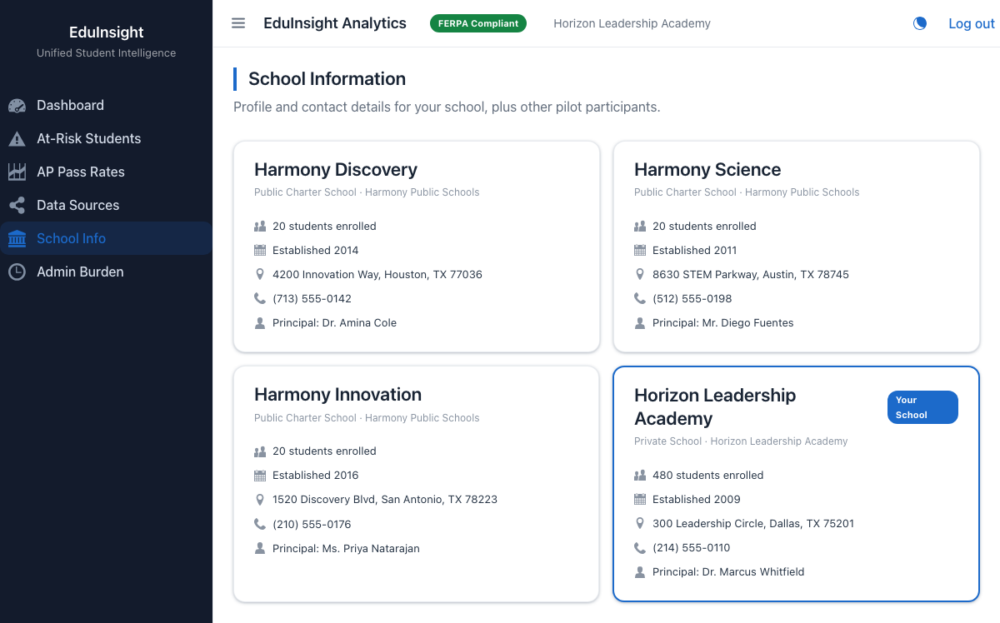
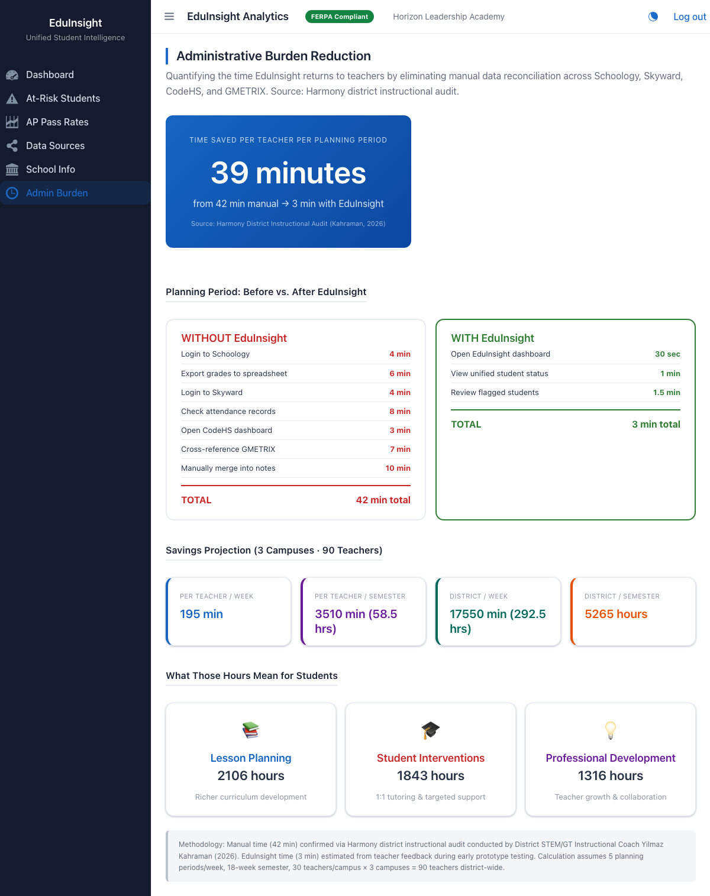

# EduInsight Analytics — MVP Demo

FERPA-compliant student data middleware that unifies Schoology, Skyward, Google Classroom, CodeHS, GMETRIX, Codeium, Edres, ClassLink, Snowflake, and Databricks into a single teacher dashboard — for **any K-12 school or district**, not a single-tenant tool built around one customer.

The platform is multi-school by design: each school or district signs in with its own credentials and sees its own name, data, and branding throughout the app. The demo ships with two example organizations to prove that out — the **Harmony Public Schools** charter network (three campuses, the original pilot partner) and **Horizon Leadership Academy**, an unrelated independent private school with no connection to Harmony. Onboarding a third district or school is a matter of adding another entry to the school directory, not a code fork.

## Stack

| Layer | Technology |
|-------|-----------|
| Backend | Java 25, Spring Boot 4.0.6 |
| Frontend | Vaadin 25.1.1 (custom Lumo theme, adaptive light/dark mode) |
| Database | H2 in-memory (demo) → Snowflake (production) |
| Build | Gradle 9.4.1 |

## Running Locally

```bash
./gradlew bootRun
```

Then open: **<http://localhost:8080>** — you'll land on the sign-in page first (see [Signing In](#signing-in) below).

H2 Console (inspect seeded data): **<http://localhost:8080/h2-console>**

- JDBC URL: `jdbc:h2:mem:eduinsight`
- Username: `sa` / Password: *(empty)*

## Signing In

Access is gated per school with a lightweight, session-based demo login (no real identity provider — this is a demo, not production auth). Whichever school you sign in as, its name replaces every generic label in the app — sidebar, header, and dashboard copy all rebrand to match.

| School | Organization | Username | Password |
|--------|--------------|----------|----------|
| Harmony Discovery | Harmony Public Schools | `harmony.discovery` | `demo123` |
| Harmony Science | Harmony Public Schools | `harmony.science` | `demo123` |
| Harmony Innovation | Harmony Public Schools | `harmony.innovation` | `demo123` |
| Horizon Leadership Academy | Independent private school | `horizon.leadership` | `demo123` |
| Harmony Public Schools — District Office | Harmony Public Schools (district-wide view) | `district.admin` | `demo123` |



The same dashboard, branded two different ways depending on who's signed in:

| Signed in as Harmony Discovery | Signed in as Horizon Leadership Academy |
|---|---|
|  |  |

## Dashboard Views

| View | Route | Description |
|------|-------|-------------|
| Dashboard | `/dashboard` (alias `/`) | Overview: student counts, risk distribution, AP rates, ingestion stats, KPI trend deltas |
| At-Risk Students | `/at-risk` | Filterable grid with early-warning flags from all connected platforms |
| AP Pass Rates | `/ap-rates` | Exam pass rates per course and campus |
| Data Sources | `/data-sources` | Platform integration cards, AI/data-analytics layer, architecture diagram, status table |
| School Info | `/school-info` | Directory of every participating school, regardless of network — contact details and enrollment |
| Admin Burden | `/admin-burden` | Time-saved metrics: 42 min → 3 min per planning period |

The app automatically follows your OS light/dark mode preference (a manual toggle in the header lets you override it for a demo).

## Screenshots

### At-Risk Student Identification



### AP Exam Pass Rate Tracker



### Connected Data Sources



### Data Integration Status Table



### School Information Directory

Every onboarded school shows up here side by side, whichever network it belongs to:



### Administrative Burden Reduction



## Demo Data

- **60 students** across 3 Harmony campuses (Discovery, Science, Innovation). Horizon Leadership Academy has no seeded student rows — it demonstrates the login/branding flow with a fixed demo enrollment figure instead, showing the platform doesn't require every tenant to share the same data pipeline.
- **Grade records** from Schoology (4 AP courses, 10 records/student)
- **Attendance records** from Skyward (50+ records/student, realistic present/absent/tardy)
- **Coding progress** from CodeHS and GMETRIX (IBC certification tracking)
- **AP assessment scores** for 11th/12th graders (realistic 1–5 distribution)
- All other integrations shown on the Data Sources page (Google Classroom, Codeium, Harmony ClassLink, Edres, Snowflake, Databricks) are illustrative/mock — there are no real API credentials or live connections behind them.

## At-Risk Scoring

A student is flagged based on data from three platforms:

| Dimension | Platform | Threshold | Weight |
|-----------|----------|-----------|--------|
| Grade Average | Schoology | < 70% | 1 flag |
| Attendance Rate | Skyward | < 90% | 1 flag |
| Coding Completion | CodeHS/GMETRIX | < 60% | 1 flag |

**Risk Level:** HIGH (3 flags) · MEDIUM (2) · LOW (1) · OK (0)

## Business Context

EduInsight addresses a market gap: enterprise data warehouse alternatives cost $250,000+ per deployment, while this platform targets Title I districts and independent schools alike. Harmony Public Schools (documented by Principal Ali Sarioglu and Coach Yilmaz Kahraman) is the original pilot partner and the source of the 42-minute-per-planning-period reduction confirmed by district audit — but the architecture is built to onboard any school or district, which is why the demo also includes an unaffiliated private school out of the box.

---

*MVP Demo — dummy data only. Not for production use. FERPA compliance documentation in progress.*
